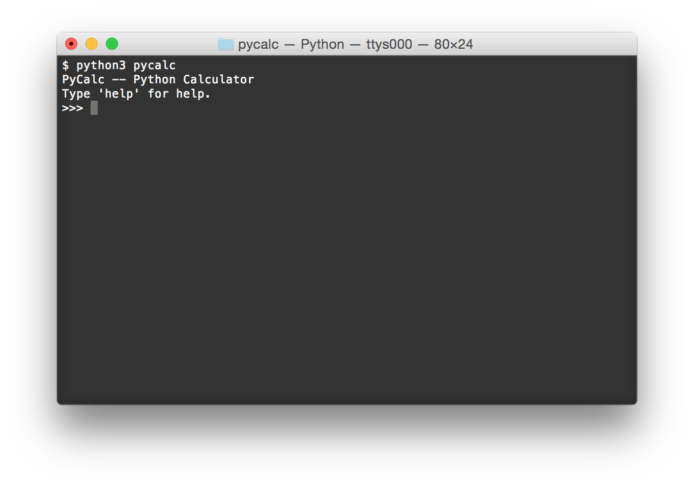
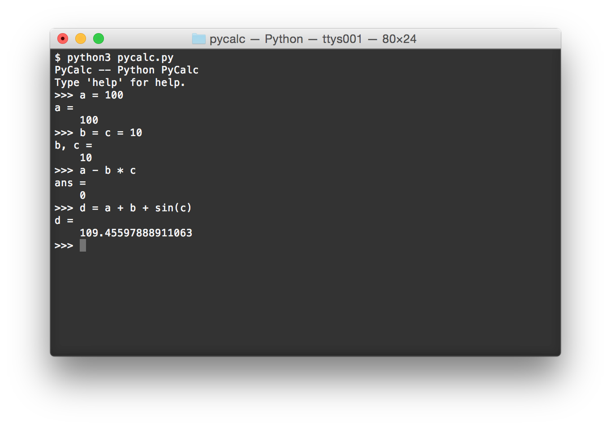
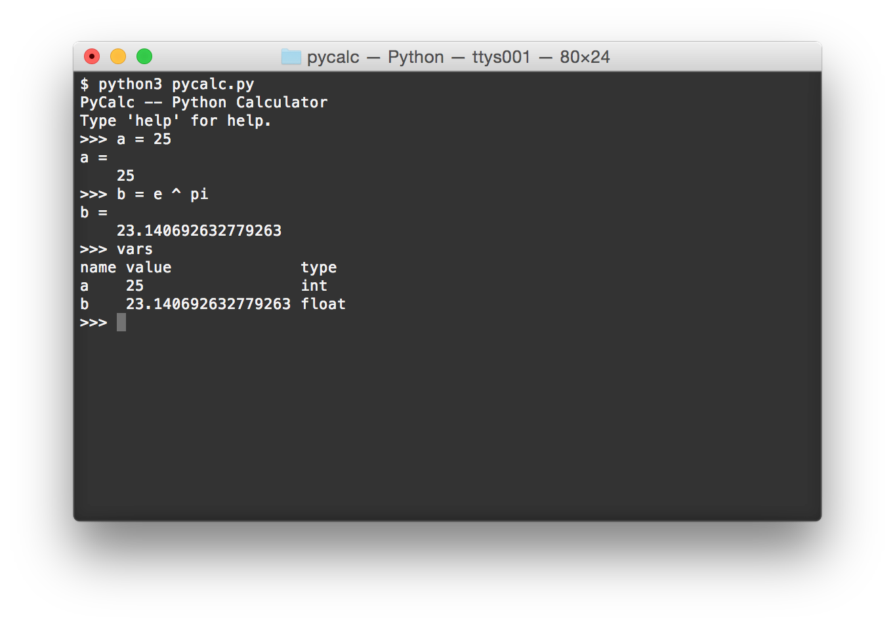
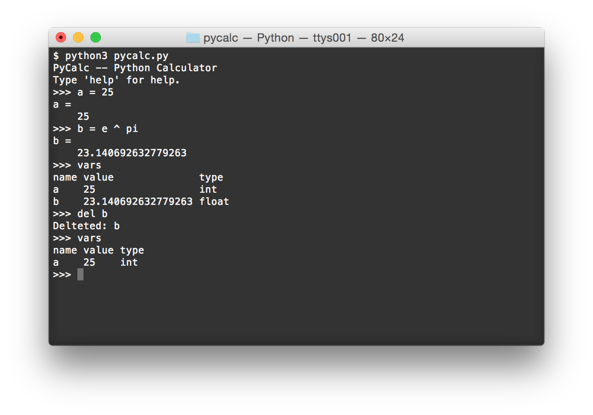

# pycalc - Python Calculator

Command-line calculator written in Python 3.

## Usage

Download `pycalc.py` and the `pycalc` directory to the same directory.
In the terminal, `cd` to this directory, and run

    $ python3 pycalc.py

You should see something like this:

At the prompt, type arithmetic expressions and have them evaluated:

The `ans =` line means that the result of the computation is stored as the variable `ans`.
You can define your own variables and use them in computations:

To see what variables are currently stored, type `vars` at the prompt:

To delete a variable, use the `del` keyword at the prompt, followed by the names of the variables you want to delete:

For more help, type `help` at the prompt.
