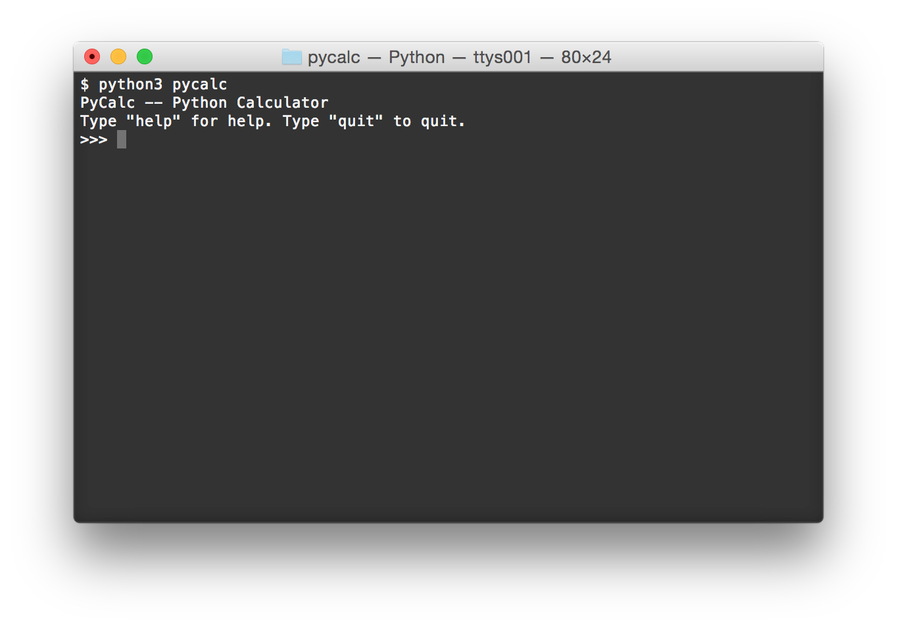
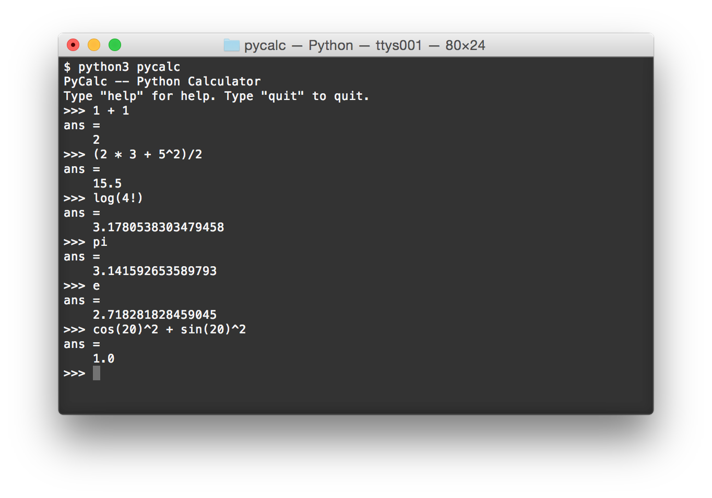
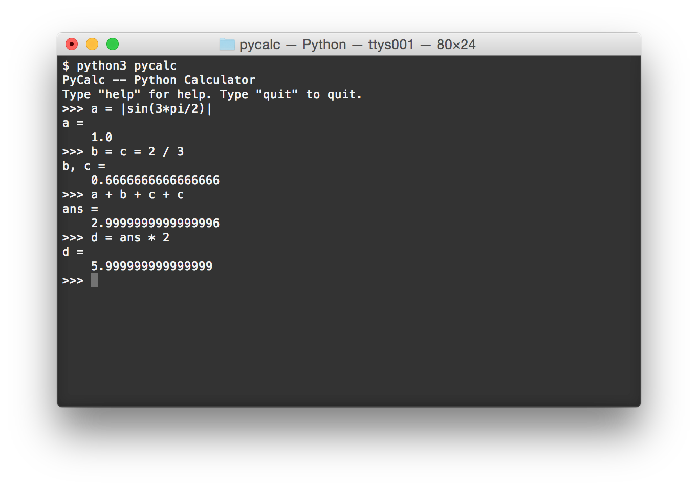
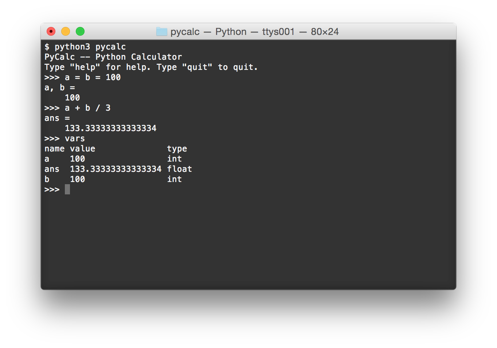
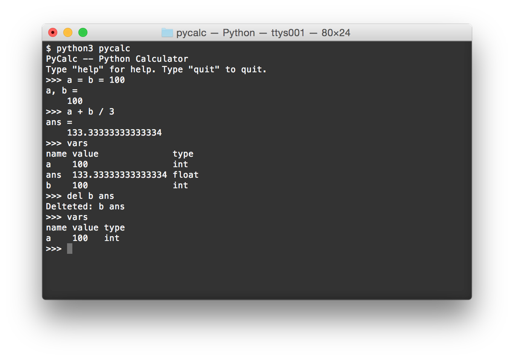
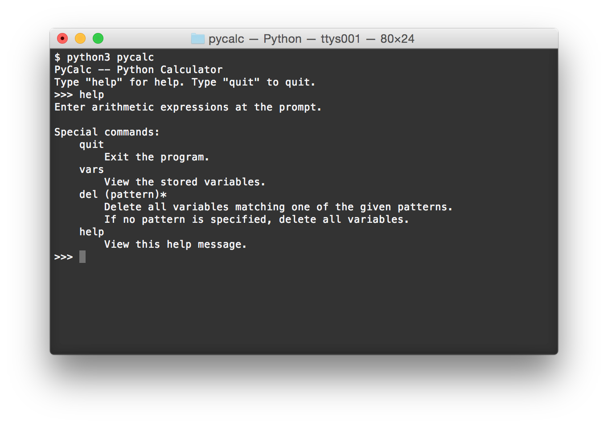
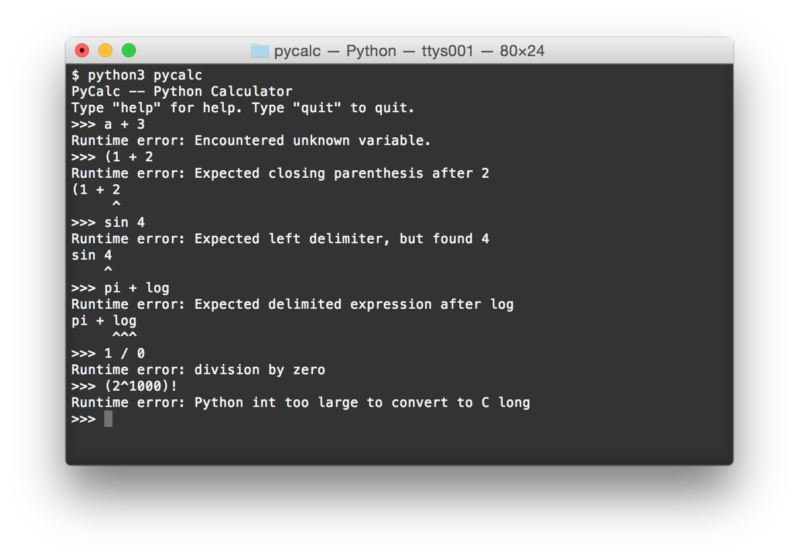

# PyCalc - Python Calculator

Calculator terminal application written in Python 3.

## Usage

### Getting started

Make sure Python 3.4 or later is installed on your system.
Run the following commands in your terminal:

    git clone https://github.com/artemmavrin/pycalc.git
    cd pycalc
    python3 pycalc

This will open the PyCalc terminal application.
You should see something like this:

To exit the program, type `quit` at the prompt.

### Evaluating Arithmetic Expressions

At the prompt, type arithmetic expressions and hit `ENTER` to have them evaluated:

PyCalc supports the following operations and functions:
* `+`, `-`, `*`, `/`, `^`: (*infix*) addition, subtraction, multiplication, division, and exponentiation.
* `!`: (*postfix*) factorial (only defined for non-negative integers).
* `exp`, `log`, `cos`, `sin`, `tan`: standard transcendental function.
* `(..)`, `|..|`: parentheses and absolute value delimiters.

### Declaring Variables

In the screenshot above, the `ans =` line means that the result of the computation is stored as the variable `ans`.
You can define your own variables and use them in computations:

### The `vars` Command

To see what variables are currently stored, type `vars` at the prompt:

### The `del` Command

To delete a variable, use the `del` keyword at the prompt, followed by the names
of the variables you want to delete:

### The `help` Command

For more help, type `help` at the prompt:

### Runtime Errors

If a computation fails, PyCalc will try to tell you why:

### Command-line Mode

PyCalc can also evaluate individual expression straight from the command-line:

    $ python3 pycalc 1+2*3
    ans =
        7
    $ python3 pycalc "exp(3)"
    ans =
        20.085536923187668
